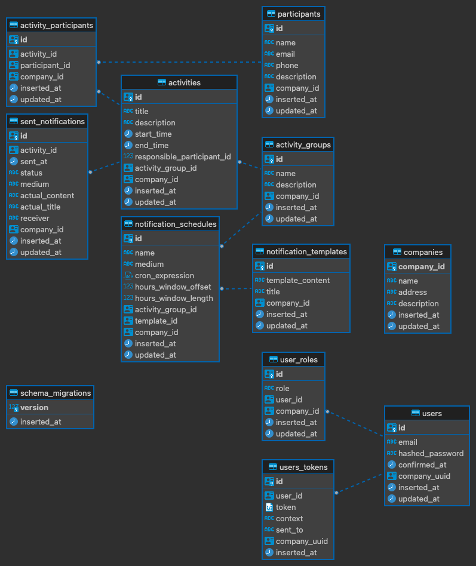

# ActivityPlanner

To start your Phoenix server:

  * Run `mix setup` to install and setup dependencies
  * Start Phoenix endpoint with `mix phx.server` or inside IEx with `iex -S mix phx.server`

Now you can visit [`localhost:4000`](http://localhost:4000) from your browser.

Ready to run in production? Please [check our deployment guides](https://hexdocs.pm/phoenix/deployment.html).

## Start clustered nodes locally

In first terminal:
```
PORT=4000 iex --name a@127.0.0.1 -S mix phx.server
```

In second terminal:
```
PORT=4001 iex --name b@127.0.0.1 -S mix phx.server
```

Then you can play around with the job mamager and the nodes

Run in first terminal and see what node is adding the job

```
ActivityPlanner.JobManager.delete_job(%{ name: "bogus", activity_group_id: -1 })
```

Kill the terminal that said "Deleting job"

Run the command again in the now only remanining terminal.

It will say "Deleting job" plus other log statements for loading the genserver on that node.

## ER diagram

